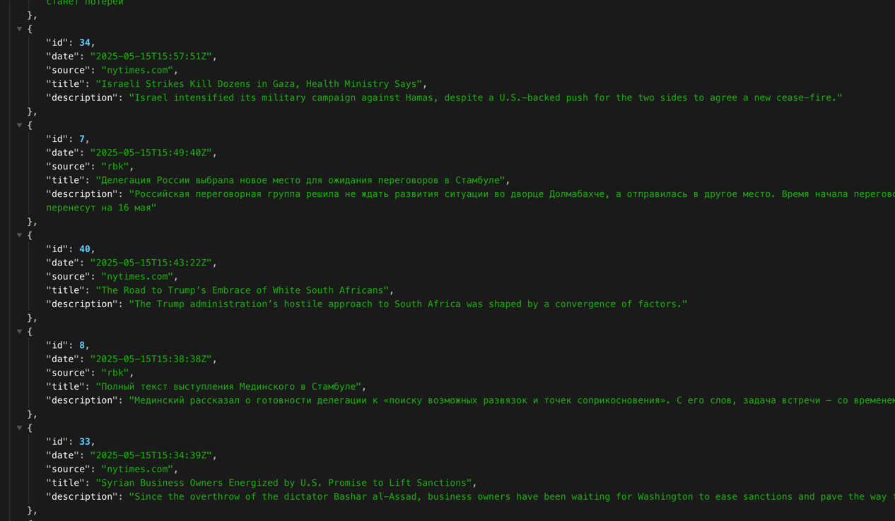

## Учебный проект - агрегатор новостей

### Функционал

1. Пользователь подает на вход адрес новостного сайта или его RSS-ленты \
и правило парсинга новостей из него.
2. База данных агрегатора начинает автоматически пополняться новостями с этого сайта.
3. У пользователя есть возможность просматривать список новостей из базы\
и искать их по подстроке в заголовке новости.
4. Валидация входных данных
5. Интеграционные тесты с Wiremock

### Локальный запуск
- `sh .dev/start.sh`
- `sh .dev/stop.sh`

### API редактирования источников новостей
- Добавить источник: \
`curl -X POST -H "Content-Type: application/json" http://127.0.0.1:8080/sources -d "{\"name\":\"rbk\",\"url\":\"https://rssexport.rbc.ru/rbcnews/news/90/full.rss\",\"rules\":{\"item_path\":\"//item\",\"title_path\":\"title\",\"description_path\":\"description\",\"date_path\":\"pubDate\",\"date_format\":\"EEE, dd MMM yyyy HH:mm:ss Z\"}}"`
- Удалить источник по id: \
`curl -X POST -H "Content-Type: application/json" http://127.0.0.1:8080/sources/remove -d "{ \"id\": 5 }" `

### API просмотра новостей
- Все новости по всем источникам: `http://localhost:8080/feed?dateFrom=2025-07-01T06:08:01Z&count=30`
- Поиск: `http://localhost:8080/feed?dateFrom=2025-07-01T06:08:01Z&count=30&searchText=Делегация`

### Пример выдачи
Сервер отдаёт новости в виде json-массива (можно видеть различные источники):
